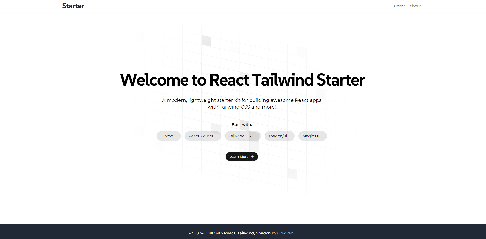

# React Tailwind Starter

A modern, lightweight starter kit for building awesome React applications with Tailwind CSS and more!



## Features

- React 18 with TypeScript
- Vite for fast development and building
- Tailwind CSS for utility-first styling
- shadcn/ui for beautifully designed, accessible components
- React Router for client-side routing
- Framer Motion for smooth animations
- Biome for linting and formatting
- Custom components and utilities for enhanced UI/UX
- Easy-peasy for state management
- Tanstack React Query for data fetching and caching
- Axios for HTTP requests
- Custom components based on shadcn/ui

## Tech Stack

- [React](https://reactjs.org/)
- [TypeScript](https://www.typescriptlang.org/)
- [Vite](https://vitejs.dev/)
- [Tailwind CSS](https://tailwindcss.com/)
- [shadcn/ui](https://ui.shadcn.com/)
- [React Router](https://reactrouter.com/)
- [Framer Motion](https://www.framer.com/motion/)
- [Biome](https://biomejs.dev/)
- [Easy-peasy](https://easy-peasy.vercel.app/)
- [Tanstack React Query](https://tanstack.com/query/latest)
- [Axios](https://axios-http.com/)

## Getting Started

1. Clone the repository
2. Install dependencies:
   ```bash
   npm install
   ```
3. Start the development server:
   ```bash
   npm run dev
   ```

## Available Scripts

- `npm run dev`: Start the development server
- `npm run build`: Build the production-ready application
- `npm run lint`: Run Biome linter
- `npm run preview`: Preview the built application

## Project Structure

- `src/`: Source files
  - `components/`: Reusable React components
    - `customs/`: Custom components based on shadcn/ui
    - `ui/`: shadcn/ui components
    - `animations/`: Animation components
  - `layout/`: Layout components (Header, Footer, Layout)
  - `pages/`: Page components
  - `lib/`: Utility functions
  - `hooks/`: Custom React hooks
  - `store/`: Easy-peasy store and related files
- `public/`: Static assets

## Custom Components

This starter includes several custom components to enhance your development experience:

1. Animated Grid Pattern
2. Particles Animation
3. Gradual Spacing Text Animation
4. Custom Accordion
5. Custom Carousel
6. Custom Drawer
7. Custom Dropdown
8. Custom Form
9. Custom Input
10. Custom Select

## State Management and Data Fetching

- Easy-peasy for global state management
- Tanstack React Query for efficient data fetching and caching
- Axios for making HTTP requests

## Customization

- Tailwind CSS configuration: `tailwind.config.js`
- Biome configuration: `biome.json`
- TypeScript configuration: `tsconfig.json` and `tsconfig.app.json`
- ESLint configuration: `eslint.config.js`

## Contributing

Contributions are welcome! Please feel free to submit a Pull Request.

## License

This project is open source and available under the [MIT License](LICENSE).